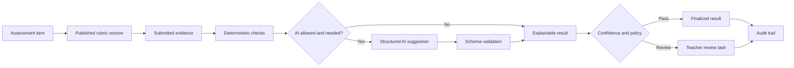
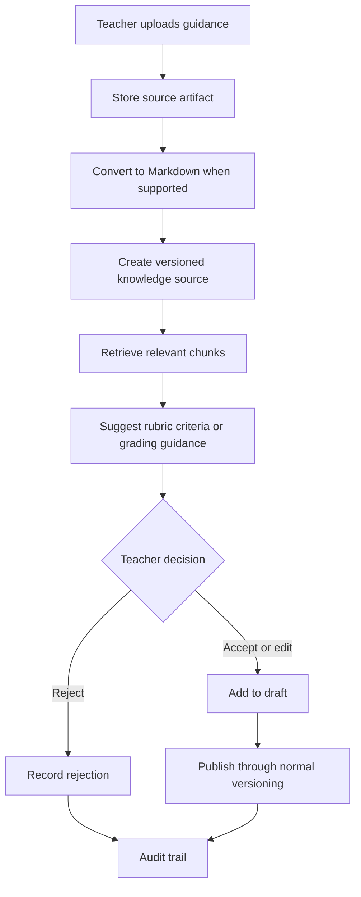

# RubriCore-STE

RubriCore-STE is a Python-first, subject-agnostic assessment core for rubric-driven grading, teacher review, reusable grading knowledge, and auditable decision-making.

It is built for learning environments where student work may be a selected option, a number, a paragraph, code, a spreadsheet, a document, a visual artifact, or a mixed evidence bundle.

## What It Does



RubriCore-STE keeps the core workflow deliberately explicit:

1. A learner submits an immutable answer package.
2. The system resolves the exact published rubric and answer-key versions.
3. Deterministic checks run before AI.
4. AI can assist only through a structured, validated boundary.
5. Confidence and policy decide whether a result can finalize or needs teacher review.
6. Results, review decisions, overrides, and superseding are preserved for audit.

## Why It Exists

Most grading systems become brittle when work is open-ended, cross-disciplinary, or partly automated. RubriCore-STE separates core assessment logic from subject-specific assumptions.

| Instead of | RubriCore-STE uses |
| --- | --- |
| Hard-coded subjects | Portable subject packs and taxonomy values |
| One grading method | Deterministic checks, structured AI assistance, and teacher review |
| Hidden scoring changes | Immutable published rubric and answer-key versions |
| File-type guesswork | Purpose-based artifact classification |
| Model-only decisions | Validated outputs, confidence routing, and audit events |
| Rewriting history | New runs, superseded results, and review records |

## Current Backend Slice

This repository is in early Phase 1 development. The current public backend foundation includes:

| Area | Implemented shape |
| --- | --- |
| Database foundation | SQLAlchemy models, Alembic migration, PostgreSQL-oriented schema |
| Taxonomy | Assessment, evidence, output, rubric, and file-purpose vocabulary |
| Rubrics | Draft rubrics, immutable published versions, materialized criteria, levels, descriptors, and bindings |
| Answer lifecycle | Draft, submitted, superseded, withdrawn, and archived answer packages |
| Evidence | Submission evidence records and artifact provenance model |
| Grading orchestration | Run creation, deterministic scoring, optional AI interaction records, confidence routing, review tasks, and audit events |
| Review | Review task, teacher review, and teacher override records |
| Fixtures | Public-safe synthetic Python score-summary assignment fixture |
| Tests | Unit coverage for taxonomy, rubric framework, answer lifecycle, artifact provenance, and grading orchestration |

The project is not yet a complete production application or user-facing grading UI.

## Repository Map

```text
.
├── app/
│   └── db/
│       ├── models/       # SQLAlchemy domain models
│       └── services/     # Rubric, answer lifecycle, and grading orchestration services
├── alembic/              # Database migrations
├── docs/
│   ├── setup.md
│   ├── design-system.md
│   ├── use-cases-and-case-studies.md
│   └── logic/            # Public architecture and workflow logic
├── private-docs/         # Local/private design docs; ignored by Git
├── scripts/              # Development helper scripts
├── tests/                # Unit tests and synthetic fixtures
├── pyproject.toml
├── requirements.txt
└── README.md
```

## Start Here

| Document | Use it for |
| --- | --- |
| [docs/setup.md](docs/setup.md) | Local environment and database setup |
| [docs/design-system.md](docs/design-system.md) | Product principles and architecture posture |
| [docs/use-cases-and-case-studies.md](docs/use-cases-and-case-studies.md) | User stories, case studies, and workflow sketches |
| [docs/logic/01-setupdb.md](docs/logic/01-setupdb.md) | Persistence, provenance, artifacts, IDs, and audit linkage |
| [docs/logic/02-assessment-taxonomy.md](docs/logic/02-assessment-taxonomy.md) | Subject-agnostic classification and compatibility boundaries |
| [docs/logic/03-rubric-framework.md](docs/logic/03-rubric-framework.md) | Rubric entities, publishing, bindings, and deterministic scoring |
| [docs/logic/04-answer-lifecycle.md](docs/logic/04-answer-lifecycle.md) | Submitted answer package immutability, revisions, regrades, and superseding |
| [docs/logic/05-grading-orchestration.md](docs/logic/05-grading-orchestration.md) | Grading runs, deterministic-first execution, AI validation, confidence routing, and review tasks |

## Quick Start

Create the environment:

```sh
git clone <repository-url>
cd RubriCore-STE
uv sync --dev
cp .env.example .env
```

Apply migrations after PostgreSQL is configured:

```sh
uv run alembic upgrade head
```

Seed local synthetic development data:

```sh
uv run python scripts/seed_dev.py
```

Run tests and linting:

```sh
.venv/bin/pytest
.venv/bin/ruff check .
```

Optional development checks:

```sh
uv run ruff format .
uv run pyright
uv run pre-commit run --all-files
```

Install Git hooks once per clone:

```sh
uv run pre-commit install
```

Package the public backend, tests, and docs for low-token AI review:

```sh
npx repomix --config repomix.config.json
```

## Core Concepts

| Concept | Purpose |
| --- | --- |
| `Assessment` and `AssessmentItem` | Durable authored task context |
| `Submission` | Learner answer package; immutable after submission |
| `SubmissionEvidence` | Typed answer evidence, raw text, value payload, or file-backed artifact link |
| `RubricVersion` | Immutable published rubric snapshot used for grading |
| `AnswerKeyVersion` | Immutable published answer-key snapshot when deterministic key checks apply |
| `GradingRun` | One execution attempt against a submission and fixed grading context |
| `GradingResult` | Proposed, finalized, reviewed, overridden, or superseded outcome |
| `CriterionResult` | Criterion-level score, explanation, source, and confidence |
| `AIInteraction` | Provider/model/prompt/schema trace for AI-assisted evaluation |
| `ReviewTask` | Teacher-facing queue item for low-confidence, ambiguous, disputed, or policy-sensitive results |
| `AuditEvent` | Append-only history of important lifecycle and grading transitions |

## Implementation Posture

RubriCore-STE favors plain, auditable service logic over hidden workflow magic.

- deterministic checks run before AI
- AI output must be structured and validated
- published rubric and answer-key versions are immutable
- submitted evidence is not edited in place
- low-confidence or policy-exception cases route to teacher review
- regrades create new runs rather than rewriting old results
- final displayed outcomes should come from non-superseded finalized, reviewed, or overridden results

## Knowledge-Learning Loop

Teacher-added knowledge should make future grading setup better, but it should never silently become grading authority.



## Roadmap

| Horizon | Focus |
| --- | --- |
| Phase 1 | Core database foundation, deterministic grading, grading orchestration, review tasks, overrides, and audit trail |
| Phase 2 | Knowledge-library MVP, Markdown conversion, and teacher-approved rubric suggestions |
| Phase 3 | Evaluation datasets, calibration, reliability metrics, and model/prompt regression testing |
| Phase 4 | Provider routing, fallback policy, scale-out, and batch grading |
| Phase 5 | Self-hosted AI evaluation and deployment options |

## Data Safety

Only synthetic sample data belongs in public files.

Do not commit real student work, private prompts, private rubrics, private knowledge-library sources, unpublished evaluation datasets, production credentials, or sensitive school and learner information.

## Contributing Principles

- keep the platform subject-agnostic
- keep published grading context immutable
- keep AI output structured, validated, and traceable
- keep teacher review visible and auditable
- keep private data out of public docs and fixtures
- prefer small, well-scoped changes that fit the existing architecture
