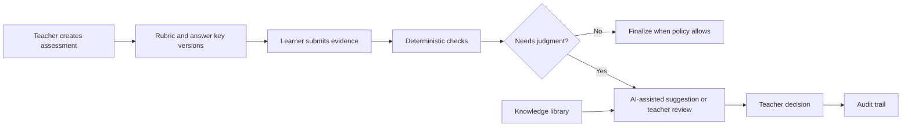
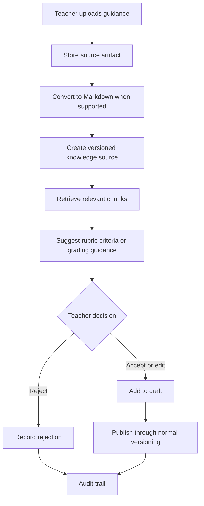

# RubriCore-STE

RubriCore-STE is a Python-first, subject-agnostic assessment core for rubric-driven grading, teacher review, reusable grading knowledge, and auditable decision-making.

It is built for learning environments where student work may be a selected option, a number, a paragraph, code, a spreadsheet, a document, a visual artifact, or a mixed evidence bundle.

## Why It Exists

Most grading tools become brittle when work is open-ended, cross-disciplinary, or partly automated. RubriCore-STE separates the core assessment lifecycle from subject-specific assumptions:

| Instead of | RubriCore-STE uses |
| --- | --- |
| Hard-coded subjects | Portable subject packs |
| One grading method | Deterministic checks, AI suggestions, and teacher review |
| Hidden rubric changes | Immutable published rubric and answer key versions |
| File-type guesswork | Purpose-based artifact classification |
| Untraceable AI output | Structured validation, citations, and audit events |

## Product Shape



## Core Ideas

| Concept | Purpose |
| --- | --- |
| Assessment types | Describe the task: quiz, short answer, code assignment, lab report, project, critique |
| Evidence types | Describe the submitted work: text, number, file, code, image, audio, video, table, bundle |
| Rubric types | Describe the scoring shape: binary key, checklist, analytic, holistic, weighted criteria |
| Subject packs | Add discipline-specific configuration without changing the core lifecycle |
| Knowledge sources | Store reusable teacher guidance as Markdown or converted artifacts |
| Review tasks | Route uncertainty, ambiguity, low confidence, and policy-sensitive cases to teachers |
| Audit events | Preserve who did what, why, and with which grading context |

## Rubric Framework

The first production-ready rubric framework is implemented in the backend model and service layer. It keeps the existing versioned JSON rubric snapshot for durable audit records, and adds normalized structures so scoring logic can be inspected without AI.

| Entity | Purpose |
| --- | --- |
| `Rubric` | Stable rubric identity with title, optional slug, lifecycle status, draft schema, and subject-agnostic metadata |
| `RubricVersion` | Immutable published snapshot with version number, source metadata, publisher, and schema payload |
| `RubricCriterion` | Ordered criterion or dimension with key, label, description, optional weight, and deterministic hints |
| `PerformanceLevel` | Ordered score band with key, label, description, and numeric score |
| `RubricDescriptor` | Narrative expectation for each criterion x performance-level pair |
| `RubricBinding` | Active link from a published rubric version to an assessment, assessment item, or external evaluation context |

Lifecycle expectations:

1. Teachers or fixture importers edit `Rubric.draft_schema`.
2. Publishing validates the schema, creates the next immutable `RubricVersion`, and materializes criteria, levels, and descriptors.
3. A binding attaches a published version to an assessment context without mutating the version.
4. Future grading runs can reference the bound version, while teacher review and audit records can explain exactly which criteria, levels, descriptors, and selected score bands were used.

Rubric validation is deterministic and runs before any AI layer. The service checks required criteria, levels, ordering, non-negative level scores, positive weights, and descriptor completeness across every criterion x level pair. The deterministic scoring helper computes weighted totals from selected performance levels and works without a provider, prompt, or model.

The local seed command creates a synthetic demo rubric for the public Python score-summary fixture:

```sh
uv run python scripts/seed_dev.py
```

## Current Status

This repository is in early Phase 1 development. The public foundation currently includes:

| Area | Status |
| --- | --- |
| Backend foundation | Python package, SQLAlchemy models, Alembic migrations |
| Database model | Organizations, users, learners, assessments, rubrics, answer keys, submissions, grading, review, audit |
| Knowledge foundation | Source artifacts, access scopes, knowledge sources, chunks, recommendations, usage events |
| Fixtures | Public-safe synthetic Python assignment fixture |
| Documentation | Setup guide, design principles, combined use cases and case studies |

The project is not yet a complete production application.

## Repository Map

```text
.
├── app/                  # Python backend application package
│   └── db/               # SQLAlchemy models, session setup, seed helpers
├── alembic/              # Database migrations
├── docs/                 # Public documentation
│   ├── setup.md          # Development setup guide
│   ├── design-system.md  # Product and system design principles
│   ├── use-cases-and-case-studies.md
│   └── logic/            # Public system logic and workflow docs
│       ├── 01-setupdb.md
│       ├── 02-assessment-taxonomy.md
│       └── 03-rubric-framework.md
├── scripts/              # Development helper scripts
├── tests/                # Public fixtures and future tests
├── .env.example          # Local environment template
├── alembic.ini           # Alembic configuration
├── requirements.txt      # Python dependencies
└── README.md
```

## Start Here

Read these first:

| Document | Use it for |
| --- | --- |
| [docs/setup.md](docs/setup.md) | Local environment and database setup |
| [docs/design-system.md](docs/design-system.md) | Product principles and architecture intent |
| [docs/use-cases-and-case-studies.md](docs/use-cases-and-case-studies.md) | Concise use cases, step-by-step case studies, and flowcharts |
| [docs/logic/01-setupdb.md](docs/logic/01-setupdb.md) | Public database model, artifact provenance, and setup logic |
| [docs/logic/02-assessment-taxonomy.md](docs/logic/02-assessment-taxonomy.md) | Assessment taxonomy vocabulary and compatibility boundaries |
| [docs/logic/03-rubric-framework.md](docs/logic/03-rubric-framework.md) | Rubric entities, lifecycle, deterministic scoring, bindings, and audit expectations |

Basic local setup:

```sh
git clone <repository-url>
cd RubriCore-STE

uv sync --dev
cp .env.example .env
```

Apply database migrations once PostgreSQL is configured:

```sh
uv run alembic upgrade head
```

Seed local development records:

```sh
uv run python scripts/seed_dev.py
```

Quality checks:

```sh
uv run ruff format .
uv run ruff check .
uv run pyright
uv run pytest
uv run pre-commit run --all-files
```

Install Git hooks once per clone:

```sh
uv run pre-commit install
```

Package the public backend, tests, and docs for low-token AI review with Repomix:

```sh
npx repomix --config repomix.config.json
```

## Knowledge-Learning Loop

Teacher-added knowledge should make future grading setup better, but it should never silently become grading authority.



## Roadmap

| Horizon | Focus |
| --- | --- |
| Phase 1 | Core database foundation, deterministic grading, review tasks, overrides, audit trail |
| Phase 2 | Knowledge-library MVP, Markdown conversion, teacher-approved rubric suggestions |
| Phase 3 | Evaluation datasets, calibration, reliability metrics, model and prompt regression testing |
| Phase 4 | Provider routing, fallback policy, scale-out and batch grading |
| Phase 5 | Self-hosted AI evaluation and deployment options |

## Data Safety

Only synthetic sample data belongs in public files.

Do not commit real student work, private prompts, private rubrics, private knowledge-library sources, unpublished evaluation datasets, production credentials, or sensitive school and learner information.

## Contributing Principles

Contributions should preserve the project’s core posture:

- keep the platform subject-agnostic
- keep published grading context immutable
- keep AI output structured, validated, and traceable
- keep teacher review visible and auditable
- keep private data out of public docs and fixtures
- prefer small, well-scoped changes that fit the existing architecture
