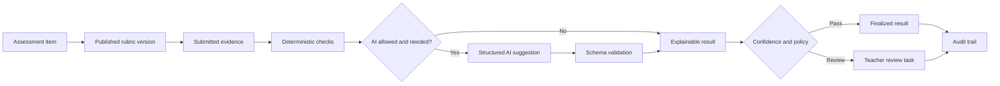
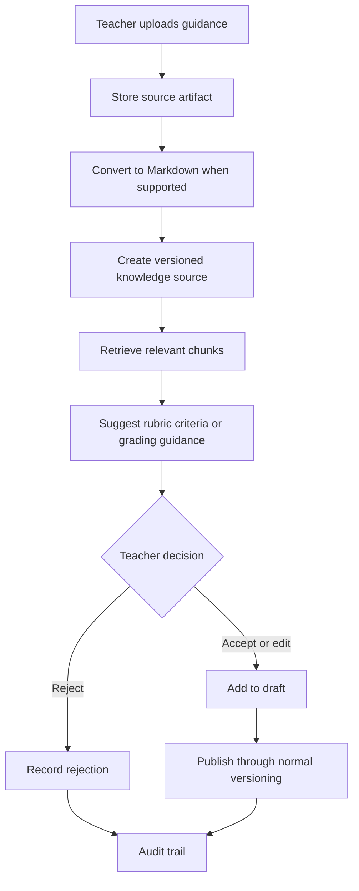

# RubriCore-STE

RubriCore-STE is a Python-first, subject-agnostic assessment core for rubric-driven grading, teacher review, reusable grading knowledge, and auditable decision-making.

It is built for learning environments where student work may be a selected option, a number, a paragraph, code, a spreadsheet, a document, a visual artifact, or a mixed evidence bundle.

## What It Does



RubriCore-STE keeps the core workflow deliberately explicit:

1. A learner submits an immutable answer package.
2. The system resolves the exact published rubric and answer-key versions.
3. Deterministic checks run before AI.
4. AI can assist only through a structured, validated boundary.
5. Confidence and policy decide whether a result can finalize or needs teacher review.
6. Results, review decisions, overrides, and superseding are preserved for audit.

## Why It Exists

Most grading systems become brittle when work is open-ended, cross-disciplinary, or partly automated. RubriCore-STE separates core assessment logic from subject-specific assumptions.

| Instead of | RubriCore-STE uses |
| --- | --- |
| Hard-coded subjects | Portable subject packs and taxonomy values |
| One grading method | Deterministic checks, structured AI assistance, and teacher review |
| Hidden scoring changes | Immutable published rubric and answer-key versions |
| File-type guesswork | Purpose-based artifact classification |
| Model-only decisions | Validated outputs, confidence routing, and audit events |
| Rewriting history | New runs, superseded results, and review records |

## Phase 1 Status

Phase 1 is complete as a backend core. The repository now has the durable schema, service logic, public docs, fixtures, and tests needed to prove the central grading workflow.

RubriCore-STE can now create and preserve versioned grading context, accept immutable submitted evidence, run deterministic grading, optionally validate AI-assisted suggestions, route uncertain results to teacher review, finalize or override results, request regrades, and preserve an audit trail.

This is not yet a production application or user-facing grading UI. Later phases should add API/UI surfaces, production auth and permissions, full answer-key authoring, reporting, deployment, and real provider integrations.

## Phase 2 Status

The Phase 2 knowledge-library backend MVP, pilot service contracts, and reusable backend workflow facade are implemented. RubriCore-STE can now register reusable knowledge sources, convert Markdown and plain text into normalized Markdown artifacts, create retrieval-ready chunks, create citation-backed rubric suggestion drafts, require teacher approval or rejection before accepted suggestions update a mutable rubric draft, validate typed pilot payloads, and compose pilot workflows for later API/UI adapters.

This is still not a production ingestion system or user-facing authoring UI. Public API/UI productization, rich document parsing, external AI suggestion generation, vector retrieval, production upload sessions, and provider integrations remain later work.

Phase 2 is complete as a backend MVP and ready to hand off into Phase 3 evaluation and calibration foundation work. See [docs/logic/13-phase2-readiness.md](docs/logic/13-phase2-readiness.md).

## Phase 3 Status

Phase 3 has a backend-only evaluation and calibration foundation. RubriCore-STE now defines public-safe evaluation dataset boundaries, includes a synthetic evaluation manifest, provides deterministic helpers and reports for score, criterion, and final/review routing comparisons, can export finalized reviewed/overridden results into the same evaluation comparison shape, and includes a local public-fixture runner.

Public API/UI productization, production provider work, rich imports, vector retrieval, and external AI integrations remain deferred. Public GitHub-safe fixtures must stay synthetic under `tests/fixtures/public/`; private or real-world evaluation datasets belong only in ignored local paths such as `tests/fixtures/private/evaluation/` or `private-docs/evaluation/`.

See [docs/logic/14-phase3-evaluation-foundation.md](docs/logic/14-phase3-evaluation-foundation.md).

## Phase 4 Status

Phase 4 has begun as backend API productization planning, a small framework-free adapter foundation, and a minimal stdlib HTTP pilot boundary. RubriCore-STE now has route-shaped adapter functions for existing public-safe workflows, with the first two POST routes wired for fixture manifest validation and public evaluation baseline reporting.

This is not yet a production HTTP API or UI. Teacher-facing UI, provider integrations, prompt execution, rich import, vector retrieval, production authentication and authorization, deployment packaging, web-framework adoption, and private fixture loading remain deferred. The Phase 4 slice preserves the boundary between public GitHub-safe synthetic fixtures under `tests/fixtures/public/` and private/local datasets that must stay in ignored paths such as `tests/fixtures/private/evaluation/` or `private-docs/evaluation/`.

See [docs/logic/15-phase4-api-productization.md](docs/logic/15-phase4-api-productization.md).

## Phase 5A Status

Phase 5A is complete as a production API readiness decision slice. RubriCore-STE keeps the current dependency-free stdlib pilot HTTP boundary for now, standardizes transport error responses, exposes route metadata with contract/auth/data-boundary posture, and documents when a production framework such as FastAPI should be introduced.

FastAPI, production auth, tenant-aware DB object loading, OpenAPI product contracts, deployed API packaging, UI, provider integrations, rich import, vector retrieval, private fixture loading, and schema changes remain deferred.

See [docs/logic/16-phase5a-production-api-readiness.md](docs/logic/16-phase5a-production-api-readiness.md).

## Phase 5B Status

Phase 5B is complete as an auth and tenancy design guardrail. RubriCore-STE now defines a dependency-free pilot auth context, role/permission map, tenant-scoped resource checks, and DB-backed route readiness guard before any tenant-owned workflow is exposed over HTTP.

This is not production login or token verification. OAuth/OIDC/SAML, API keys, sessions, middleware, tenant-aware DB-backed HTTP routes, and audit wiring for exported tenant data remain deferred until a real production API framework boundary is chosen.

See [docs/logic/17-phase5b-auth-tenancy-design.md](docs/logic/17-phase5b-auth-tenancy-design.md).

## Phase 5C Status

Phase 5C is complete as a production auth implementation plan. RubriCore-STE now documents how future middleware or dependency injection should create verified auth context, which provider styles fit later, how tenant-scoped DB loaders should work, and why the first DB-backed route should be a read-only subject-pack summary after real auth exists.

This is still not a production auth implementation. No OAuth/OIDC/JWT validation, sessions, API keys, middleware, DB-backed HTTP routes, framework dependency, schema changes, secrets, or provider integrations were added.

See [docs/logic/18-phase5c-production-auth-implementation-plan.md](docs/logic/18-phase5c-production-auth-implementation-plan.md).

## Phase 6A Status

Phase 6A adds the first FastAPI route/dependency shape. RubriCore-STE now has a FastAPI app with the existing public-safe pilot routes plus `GET /pilot/subject-packs/{key}` as the first auth-aware, tenant-scoped, DB-backed read-only route.

The auth dependency currently uses explicit pilot headers for development and tests. This is not production OAuth/OIDC/JWT validation, sessions, API keys, user lookup, or membership lookup. Review queues, grading exports, calibration exports, answer-key mutation, rubric draft mutation, UI, provider calls, rich import, vector retrieval, and schema changes remain deferred.

See [docs/logic/19-phase6a-fastapi-subject-pack-route.md](docs/logic/19-phase6a-fastapi-subject-pack-route.md).

## Phase 6B Status

Phase 6B adds a production-auth adapter boundary without adding a real provider. RubriCore-STE now has a narrow `AuthProvider.verify_request(...) -> PilotAuthContext` interface and a development-only `PilotHeaderAuthProvider` that preserves the existing explicit pilot-header behavior.

This is still not production OAuth/OIDC/JWT validation, sessions, API keys, user lookup, membership lookup, secrets, credentials, or network verification. The FastAPI subject-pack route behavior remains the same; only the auth parsing responsibility moved out of the route module.

See [docs/logic/20-phase6b-auth-provider-adapter.md](docs/logic/20-phase6b-auth-provider-adapter.md).

## Phase 6C Status

Phase 6C is complete as a production auth provider selection doc. RubriCore-STE now chooses OIDC/JWT bearer tokens as the first future production auth style and documents required config inputs, claim mapping, DB-backed organization membership expectations, and failure modes before any verification code is added.

This is still not production JWT verification, OAuth/OIDC client configuration, sessions, API keys, user lookup, membership lookup, secrets, credentials, network calls, dependency changes, schema changes, or new HTTP routes.

See [docs/logic/21-phase6c-production-auth-provider-selection.md](docs/logic/21-phase6c-production-auth-provider-selection.md).

## Phase 6D Status

Phase 6D is complete as a current-schema production-auth readiness plan. RubriCore-STE now documents a narrow first verified-auth path that can use the existing organization-scoped `users` table, with `users.organization_id`, `users.role`, and `users.status` acting as the first tenant access record under explicit constraints.

This is still not production JWT verification, OAuth/OIDC client configuration, external identity lookup, membership tables, migrations, secrets, credentials, network calls, dependency changes, or new HTTP routes. The long-term global-user and membership model is deferred until product requirements trigger it.

See [docs/logic/22-phase6d-current-schema-auth-readiness.md](docs/logic/22-phase6d-current-schema-auth-readiness.md).

## Current Backend Foundation

The current public backend foundation includes:

| Area | Implemented shape |
| --- | --- |
| Database foundation | SQLAlchemy models, Alembic migration, PostgreSQL-oriented schema |
| Taxonomy | Assessment, evidence, output, rubric, and file-purpose vocabulary |
| Rubrics | Draft rubrics, immutable published versions, materialized criteria, levels, descriptors, and bindings |
| Answer lifecycle | Draft, submitted, superseded, withdrawn, and archived answer packages |
| Evidence | Submission evidence records and artifact provenance model |
| Grading orchestration | Run creation, deterministic scoring, optional AI interaction records, confidence routing, review tasks, and audit events |
| Review | Review task, teacher review, teacher override, finalization, and return-for-regrade behavior |
| Knowledge library | Source registration, local Markdown/plain-text conversion, knowledge chunks, non-vector retrieval candidates, and teacher-approved rubric suggestion drafts |
| Evaluation foundation | Public-safe evaluation fixture boundary, synthetic evaluation manifest, deterministic comparison metrics and reports, reviewed-result calibration export, and local public fixture runner |
| API productization foundation | Framework-free Phase 4 route plan, thin adapters, and stdlib pilot HTTP boundary over existing public-safe contracts, workflows, and service helpers |
| API readiness foundation | Phase 5A framework decision, stable pilot error envelope, and route metadata for contract, auth, and data-boundary posture |
| Auth and tenancy guardrail | Phase 5B pilot auth context, role/permission map, tenant checks, and DB-backed route readiness policy before HTTP exposure |
| Production auth plan | Phase 5C provider-style decision path, verified auth-context flow, and tenant-scoped DB loading rules before real HTTP expansion |
| FastAPI route boundary | Phase 6A FastAPI app, dependency shape, tenant-scoped subject-pack loader, and first DB-backed read-only route |
| Auth provider adapter | Phase 6B framework-light provider interface and development-only pilot-header implementation |
| Production auth provider selection | Phase 6C OIDC/JWT bearer-token decision, future config inputs, claim mapping, membership lookup, and failure-mode design |
| Current-schema auth readiness | Phase 6D constrained org-scoped user auth-resolution path and migration triggers |
| Audit trail | Append-only audit records for major Phase 1 lifecycle, grading, review, and rubric-context actions |
| Fixtures | Public-safe synthetic Python score-summary assignment and evaluation fixtures with knowledge-source examples |
| Tests | Unit coverage for taxonomy, rubric framework, answer lifecycle, artifact provenance, grading orchestration, review policy, knowledge-library logic, rubric suggestions, and audit events |

## Repository Map

```text
.
├── app/
│   └── db/
│       ├── models/       # SQLAlchemy domain models
│       └── services/     # Rubric, answer lifecycle, and grading orchestration services
├── alembic/              # Database migrations
├── docs/
│   ├── setup.md
│   ├── design-system.md
│   ├── use-cases-and-case-studies.md
│   └── logic/            # Public architecture and workflow logic
├── private-docs/         # Local/private design docs; ignored by Git
├── scripts/              # Development helper scripts
├── tests/                # Unit tests and synthetic fixtures
├── pyproject.toml
├── requirements.txt
└── README.md
```

## Start Here

| Document | Use it for |
| --- | --- |
| [docs/setup.md](docs/setup.md) | Local environment and database setup |
| [docs/design-system.md](docs/design-system.md) | Product principles and architecture posture |
| [docs/use-cases-and-case-studies.md](docs/use-cases-and-case-studies.md) | User stories, case studies, and workflow sketches |
| [docs/logic/01-setupdb.md](docs/logic/01-setupdb.md) | Persistence, provenance, artifacts, IDs, and audit linkage |
| [docs/logic/02-assessment-taxonomy.md](docs/logic/02-assessment-taxonomy.md) | Subject-agnostic classification and compatibility boundaries |
| [docs/logic/03-rubric-framework.md](docs/logic/03-rubric-framework.md) | Rubric entities, publishing, bindings, and deterministic scoring |
| [docs/logic/04-answer-lifecycle.md](docs/logic/04-answer-lifecycle.md) | Submitted answer package immutability, revisions, regrades, and superseding |
| [docs/logic/05-grading-orchestration.md](docs/logic/05-grading-orchestration.md) | Grading runs, deterministic-first execution, AI validation, confidence routing, and review tasks |
| [docs/logic/06-confidence-policy.md](docs/logic/06-confidence-policy.md) | Confidence bands, routing gates, review escalation, and auditable policy payloads |
| [docs/logic/07-review-policy.md](docs/logic/07-review-policy.md) | Teacher review decisions, overrides, regrade returns, finalization, and audit trail |
| [docs/logic/08-audit-logging.md](docs/logic/08-audit-logging.md) | Append-only audit events, traceability coverage, and Phase 1 audit boundaries |
| [docs/logic/09-knowledge-library.md](docs/logic/09-knowledge-library.md) | Knowledge source registration, conversion, chunking, retrieval candidates, rubric suggestions, and teacher decisions |
| [docs/logic/10-phase2-pilot-contracts.md](docs/logic/10-phase2-pilot-contracts.md) | Pilot request/response contracts for Phase 2 backend workflows before public API/UI productization |
| [docs/logic/11-phase2-pilot-api-plan.md](docs/logic/11-phase2-pilot-api-plan.md) | Future pilot API route plan that wraps the Phase 2 contracts without moving business logic into routes |
| [docs/logic/12-phase2-backend-productization.md](docs/logic/12-phase2-backend-productization.md) | Backend productization boundary for reusable Phase 2 pilot workflow entry points |
| [docs/logic/13-phase2-readiness.md](docs/logic/13-phase2-readiness.md) | Phase 2 backend MVP readiness marker and Phase 3 starting checklist |
| [docs/logic/14-phase3-evaluation-foundation.md](docs/logic/14-phase3-evaluation-foundation.md) | Phase 3 public-safe evaluation dataset boundary and backend metric helpers |
| [docs/logic/15-phase4-api-productization.md](docs/logic/15-phase4-api-productization.md) | Phase 4 backend API productization plan and thin adapter foundation |
| [docs/logic/16-phase5a-production-api-readiness.md](docs/logic/16-phase5a-production-api-readiness.md) | Phase 5A production API framework decision and structural readiness boundary |
| [docs/logic/17-phase5b-auth-tenancy-design.md](docs/logic/17-phase5b-auth-tenancy-design.md) | Phase 5B auth and tenancy design guardrail before DB-backed HTTP routes |
| [docs/logic/18-phase5c-production-auth-implementation-plan.md](docs/logic/18-phase5c-production-auth-implementation-plan.md) | Phase 5C production auth context and tenant-scoped DB loading implementation plan |
| [docs/logic/19-phase6a-fastapi-subject-pack-route.md](docs/logic/19-phase6a-fastapi-subject-pack-route.md) | Phase 6A FastAPI route/dependency shape and first auth-aware DB-backed route |
| [docs/logic/20-phase6b-auth-provider-adapter.md](docs/logic/20-phase6b-auth-provider-adapter.md) | Phase 6B production-auth adapter boundary without a real auth provider |
| [docs/logic/21-phase6c-production-auth-provider-selection.md](docs/logic/21-phase6c-production-auth-provider-selection.md) | Phase 6C production auth provider selection without implementation |
| [docs/logic/22-phase6d-current-schema-auth-readiness.md](docs/logic/22-phase6d-current-schema-auth-readiness.md) | Phase 6D current-schema production auth readiness without implementation |

## Quick Start

Create the environment:

```sh
git clone <repository-url>
cd RubriCore-STE
uv sync --dev
cp .env.example .env
```

Apply migrations after PostgreSQL is configured:

```sh
uv run alembic upgrade head
```

Seed local synthetic development data:

```sh
uv run python scripts/seed_dev.py
```

Run tests and linting:

```sh
.venv/bin/pytest
.venv/bin/ruff check .
```

Run the public-safe Phase 3 evaluation fixture baseline:

```sh
.venv/bin/python scripts/run_public_evaluation_fixture.py --baseline
```

Run the Phase 4 API-adapter smoke tests:

```sh
.venv/bin/pytest tests/test_phase4_api_adapters.py tests/test_phase4_http_api.py tests/test_phase4_http_smoke_script.py tests/test_phase5a_api_readiness.py tests/test_phase5b_auth_tenancy_design.py tests/test_phase5c_auth_plan_docs.py tests/test_phase6a_fastapi_subject_pack.py
```

Run the local Phase 4 pilot HTTP smoke script:

```sh
.venv/bin/python scripts/smoke_phase4_http_api.py
```

Optionally run the local pilot HTTP server:

```sh
.venv/bin/python -m app.pilot.http_api --host 127.0.0.1 --port 8080
```

Optional development checks:

```sh
uv run ruff format .
uv run pyright
uv run pre-commit run --all-files
```

Install Git hooks once per clone:

```sh
uv run pre-commit install
```

Package the public backend, tests, and docs for low-token AI review:

```sh
npx repomix --config repomix.config.json
```

## Core Concepts

| Concept | Purpose |
| --- | --- |
| `Assessment` and `AssessmentItem` | Durable authored task context |
| `Submission` | Learner answer package; immutable after submission |
| `SubmissionEvidence` | Typed answer evidence, raw text, value payload, or file-backed artifact link |
| `RubricVersion` | Immutable published rubric snapshot used for grading |
| `AnswerKeyVersion` | Immutable published answer-key snapshot when deterministic key checks apply |
| `GradingRun` | One execution attempt against a submission and fixed grading context |
| `GradingResult` | Proposed, finalized, reviewed, overridden, or superseded outcome |
| `CriterionResult` | Criterion-level score, explanation, source, and confidence |
| `AIInteraction` | Provider/model/prompt/schema trace for AI-assisted evaluation |
| `ReviewTask` | Teacher-facing queue item for low-confidence, ambiguous, disputed, or policy-sensitive results |
| `KnowledgeSource` | Versioned reusable grading knowledge linked to source and converted Markdown artifacts |
| `KnowledgeChunk` | Deterministic Markdown-derived retrieval and citation unit |
| `RubricSuggestion` | Citation-backed draft recommendation that requires teacher decision before changing a rubric draft |
| `AuditEvent` | Append-only history of important lifecycle and grading transitions |

## Implementation Posture

RubriCore-STE favors plain, auditable service logic over hidden workflow magic.

- deterministic checks run before AI
- AI output must be structured and validated
- published rubric and answer-key versions are immutable
- submitted evidence is not edited in place
- low-confidence or policy-exception cases route to teacher review
- regrades create new runs rather than rewriting old results
- final displayed outcomes should come from non-superseded finalized, reviewed, or overridden results

## Knowledge-Learning Loop

Teacher-added knowledge should make future grading setup better, but it should never silently become grading authority.



## Repository Readiness

Tracked files are intended to be public-safe: source code, migrations, setup files, public docs, and synthetic fixtures. Local caches, virtual environments, `.env`, private docs, private fixtures, local artifacts, and database dumps are ignored.

The project uses the MIT License. Before a broader public release, consider adding a lightweight project-specific contribution policy.

## Roadmap

| Horizon | Focus |
| --- | --- |
| Phase 1 | Complete: core database foundation, deterministic grading, grading orchestration, review tasks, overrides, and audit trail |
| Phase 2 | Complete as backend MVP: knowledge-library backend, pilot services, contracts, and workflow facade implemented; public API/UI, richer import workflows, and provider integrations deferred |
| Phase 3 | Evaluation datasets, calibration, reliability metrics, and model/prompt regression testing |
| Phase 4 | Provider routing, fallback policy, scale-out, and batch grading |
| Phase 5 | Self-hosted AI evaluation and deployment options |

## Data Safety

Only synthetic sample data belongs in public files.

Do not commit real student work, private prompts, private rubrics, private knowledge-library sources, unpublished evaluation datasets, production credentials, or sensitive school and learner information.

## Contributing Principles

- keep the platform subject-agnostic
- keep published grading context immutable
- keep AI output structured, validated, and traceable
- keep teacher review visible and auditable
- keep private data out of public docs and fixtures
- prefer small, well-scoped changes that fit the existing architecture

## License

RubriCore-STE is licensed under the [MIT License](LICENSE).
